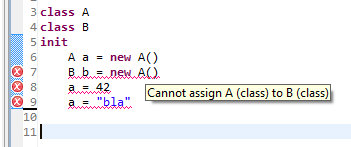

Wurst ist eine Sprache, die ähnlich wie vJass, cJass oder zinc übersetzt werden kann. 

Warum eine neue Sprache? 
===========================

## Editor Support

VJass basiert stark auf Textersetzungen (vJass modules, textmacros). Das macht es schwer einen 
guten Editor mit Features wie autocomplete für vJass zu schreiben.

Wurst setzt auf sehr einfach strukturierten Code, welcher in einer Compiler-Phase analysiert werden kann. 
VJass benötigt hingegen [mehrere Phasen](http://www.wc3c.net/vexorian/zincmanual.html#compileerror).

Der Editor Support für Wurst ist als Eclipse Plugin realisiert. Mehr Informationen dazu folgen später.

## Typsicherheit

VJass ist nicht typsicher. Als Beispiel nehme man den folgenden Code:

*vJass Code*

	struct A
	endstruct

	struct B
	endstruct

	private function init takes nothing returns nothing
		local A a = A.create()
		local B b = A.create() // no error ...
		set a = 42 // no error ...
		set a = "bla" // pjass error
	endfunction

VJass prüft nicht, ob in einer Variable vom Typ B auch wirklich nur Objekte vom Typ B gespeichert sind.
Dies kann zu Fehlern führen, die man erst spät entdeckt oder man bekommt einen pJass Fehler,
der teilweise nicht leicht zu verstehen ist. 

Der entsprechende Wurst-Code sieht folgendermaßen aus (Screenshot aus dem Eclipse Plugin):

## Weniger schreiben, einfacher Lesen

VJass hat einige redundate Syntax-Elemente. Beispiele dafür sind "set", "call"
oder "takes nothing returns nothing". Gleichzeitg hat vJass sehr wenige Elemente, 
die es erlauben Code zu schreiben, der besser lesbar ist. Insbesondere gibt es nur 
eine Form von Schleife.

Features
========

